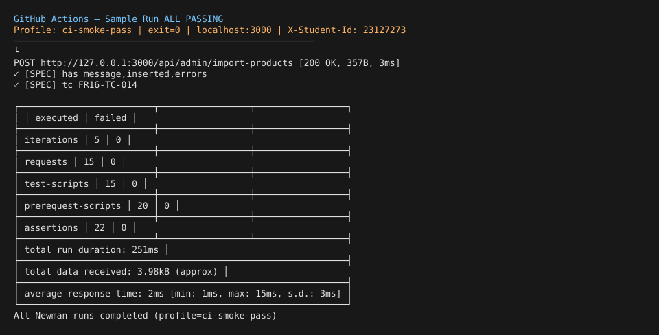
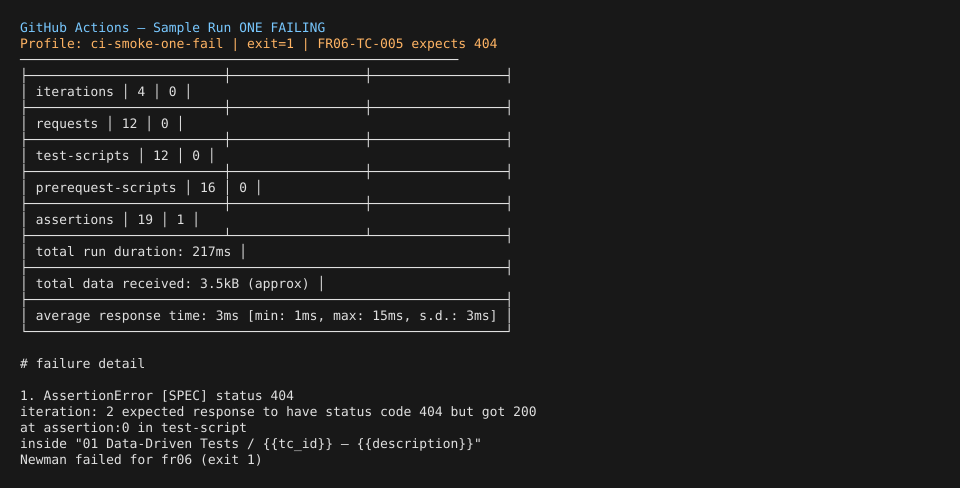

# CI/CD Report — HW06 API Testing

Student ID: `23127273` · Repo: [minhtrile293/Software-Testing-HW06](https://github.com/minhtrile293/Software-Testing-HW06)

## 1. Pipeline Configuration

| Item | Value |
|---|---|
| Workflow | [`.github/workflows/api-tests.yml`](../.github/workflows/api-tests.yml) |
| Trigger | `push` / `pull_request` on `main`, plus `workflow_dispatch` |
| Runner | `ubuntu-latest` |
| SUT | Clone [ttbhanh/eshop-sut](https://github.com/ttbhanh/eshop-sut) → `backend/` → `node server.js` on port **3000** |
| Test tool | Newman 6.x + `newman-reporter-htmlextra` |
| Data-driven | Newman `-d postman/data/*.csv` per API |
| Header | `X-Student-Id: 23127273` (collection pre-request script) |
| Artifacts | `results/newman/*.html` uploaded per run |

### Steps

1. Checkout HW06 repo  
2. Setup Node 22, install Newman globally  
3. `scripts/ci-start-sut.sh` — clone SUT, `npm install`, start backend, wait for `/api/products`  
4. Read profile from `ci-cd/profile.txt` (or `workflow_dispatch` input)  
5. `scripts/ci-run-newman.sh <profile>` — FR06 + FR07 + FR16  
6. Upload Newman HTML reports as artifact  

### Newman profiles

| Profile | Data files | Purpose |
|---|---|---|
| `ci-smoke-pass` | `fr*-ci-smoke-pass.csv` | **All assertions pass** (CI green demo) |
| `ci-smoke-one-fail` | FR06 `fr06-ci-smoke-one-fail.csv` + FR07/16 smoke pass | **Exactly 1 failing assertion** (FR06-TC-005) |
| `full` | Full regression CSVs (48+46+46 rows) | Local/optional CI; **73 expected failures** (SUT bugs); `CI_ALLOW_FAILURE=true` |

Default on push: value in [`ci-cd/profile.txt`](profile.txt) → currently **`ci-smoke-pass`**.

Manual override: GitHub → Actions → **API Tests (HW06)** → Run workflow → choose profile.

---

## 2. Sample Run — All Passing

| Field | Value |
|---|---|
| Profile | `ci-smoke-pass` |
| Commit (local verify) | _(set after push — use commit with `ci-cd/profile.txt` = `ci-smoke-pass`)_ |
| Commit message | `ci: integrate GitHub Actions smoke-pass pipeline` |
| Pipeline URL | `https://github.com/minhtrile293/Software-Testing-HW06/actions/workflows/api-tests.yml` |
| Result | **15 requests, 22 assertions, 0 failed** (local Newman against localhost:3000) |
| Artifact | `newman-reports-ci-smoke-pass-<run_id>` |



**Evidence:** FR06/07/16 smoke subsets — auth 401/403, valid reads, admin import schema — all match SUT behaviour.

---

## 3. Sample Run — One Failing

| Field | Value |
|---|---|
| Profile | `ci-smoke-one-fail` |
| Commit (local verify) | _(set after push — change `ci-cd/profile.txt` to `ci-smoke-one-fail`)_ |
| Commit message | `ci: demo pipeline with one intentional failure (FR06-TC-005)` |
| Pipeline URL | same workflow |
| Result | **14 requests, 19 assertions, 1 failed** — `FR06-TC-005` expects **404**, SUT returns **200 {}** (BUG-001) |
| Artifact | `newman-reports-ci-smoke-one-fail-<run_id>` |



---

## 4. How to reproduce the two sample commits

```bash
# Commit 1 — all passing (default)
echo 'ci-smoke-pass' > ci-cd/profile.txt
git add ci-cd/profile.txt .github/workflows/api-tests.yml scripts/ci-*.sh postman/data/fr*-ci-smoke*.csv
git commit -m "ci: GitHub Actions smoke-pass pipeline"
git push   # → green workflow

# Commit 2 — one failing
echo 'ci-smoke-one-fail' > ci-cd/profile.txt
git commit -am "ci: demo one failing assertion in pipeline"
git push   # → red workflow (1 failed assertion)
```

Optional full regression (does not fail the job):

```bash
# workflow_dispatch → newman_profile = full
# or locally:
CI_ALLOW_FAILURE=true bash scripts/ci-run-newman.sh full
```

---

## 5. Local CI simulation

```bash
# SUT must be on :3000 (or run ci-start-sut.sh)
bash scripts/ci-start-sut.sh
bash scripts/ci-run-newman.sh ci-smoke-pass
bash scripts/ci-run-newman.sh ci-smoke-one-fail   # exits 1
python3 scripts/capture-ci-screenshots.py         # refresh ci-cd/screenshots/*.svg
```

---

## 6. Notes

- Newman targets `http://127.0.0.1:3000` — satisfies §11 anti-cheat (localhost hostname in CI logs).
- Full regression **must fail** while SUT bugs exist; smoke profiles isolate demo runs for TA.
- After push, paste Actions run URLs into §2 and §3 above.
